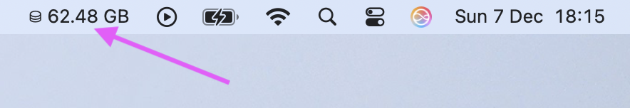

# Free-disk-space-widget

Simple MacOS app to show free disk space in menubar.




## Build

```bash
go build -ldflags="-s -w" .
```

## Run on login

```bash
./create-autosta-file.sh
```
This creates a `free-disk-space-widget.autostart.plist` file in `~/Library/LaunchAgents/` directory.

Then add the plist to launchctl:

```bash
launchctl load ~/Library/LaunchAgents/free-disk-space-widget.autostart.plist
```

To revert that, remove the plist from launchctl:
```bash
launchctl unload ~/Library/LaunchAgents/free-disk-space-widget.autostart.plist
```
