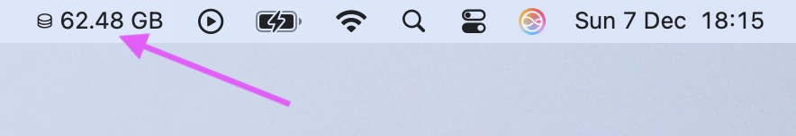

# Free Disk Space Widget

Simple macOS menu bar app that shows free disk space.



## Build

```bash
go build -ldflags="-s -w" .
```

To update the repo-managed startup binary:

```bash
go build -ldflags="-s -w" -o ../../vendor/bin/free-disk-space-widget .
```

## Run on login

From the dotfiles repo:

```bash
setup/install/free-disk-space-widget.sh
```

This installs the repo-managed binary to `~/.local/bin/free-disk-space-widget`,
writes `~/Library/LaunchAgents/com.jayu.free-disk-space-widget.plist`, and
starts it with `launchctl`.
