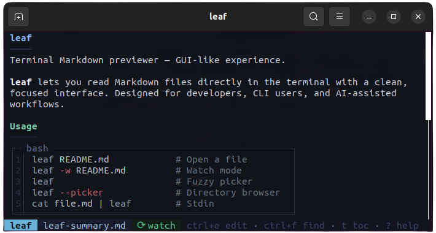

<p align="center">
  
</p>

<p align="center">
  Terminal Markdown previewer — GUI-like experience.
</p>

<p align="center">
  <br>
  <sub>See more screenshots in the <a href="demo/README.md">features</a> demo</sub>
</p>

## Install

Install the latest published binary.

**macOS / Linux / Android / Termux:**

```bash
curl -fsSL https://raw.githubusercontent.com/RivoLink/leaf/main/scripts/install.sh | sh
```

**Windows:**

```powershell
irm https://raw.githubusercontent.com/RivoLink/leaf/main/scripts/install.ps1 | iex
```

**npm:**

```bash
npm install -g @rivolink/leaf
```

**ArchLinux (AUR):**

Use an [AUR helper](https://wiki.archlinux.org/title/AUR_helpers), such as `yay`:

```bash
yay -S leaf-markdown-viewer
```

**Verify the installation:**

```bash
leaf --version
```

## Update

Update an existing installation to the latest published release.

**Self:**

```bash
leaf --update
```

`leaf --update` downloads the matching published asset, verifies it against the published `checksums.txt` SHA256, and then installs it.

On Windows, if replacing the running `.exe` is blocked by the OS, rerun the PowerShell installer from the install section.

**npm:**

```bash
npm update -g @rivolink/leaf
```

## Usage

```bash
# Open a Markdown file
leaf TESTING.md

# Watch mode — reloads automatically on save
leaf --watch TESTING.md
leaf -w TESTING.md

# Open the fuzzy Markdown picker
leaf

# Open the classic directory browser picker
leaf --picker

# Open the fuzzy Markdown picker, then watch the selected file
leaf -w

# Open the classic directory browser picker, then watch the selected file
leaf -w --picker

# Open a dash-prefixed filename
leaf -- -notes.md

# Stream Markdown from another CLI tool
claude "explain Rust lifetimes" | leaf

# Preview a local file through stdin
cat TESTING.md | leaf
```

## Inline Mode

Render Markdown directly to **stdout** without the interactive TUI:

```bash
# Render to terminal with colors
leaf --inline README.md

# Force plain text, no ANSI codes (no colors)
leaf --inline plain README.md

# Force ANSI colors even when piping
leaf --inline ansi README.md

# Set a specific width
leaf --inline 60 README.md
leaf --inline ansi:60 README.md

# Pipe from stdin
cat README.md | leaf --inline

# Use as a fzf preview
find . -name '*.md' | fzf --preview 'leaf --inline ansi {}'
find . -name '*.md' | fzf --preview 'leaf --inline ansi:$FZF_PREVIEW_COLUMNS {}'
```

## Shell Completions

Enable Tab completion for all arguments:

```bash
leaf --auto-complete
```

Supports **bash**, **zsh**, **fish**, and **PowerShell**. Restart your shell to activate.

## Vim Integration
Add the following to your `~/.vimrc` to preview the current Markdown file in a vertical split:

```vim
" Preview the current Markdown file in a vertical split using leaf
nnoremap <Leader>md :vertical botright terminal leaf -w %<CR>
```

Once added, use `\md` to open a live preview. To switch focus back to the Markdown buffer, press `Ctrl+w,h`.

## Configuration

Set default values for **theme**, **editor**, **watch** mode and **extra** file types via `config.toml`:

```bash
leaf --config
```

This opens the configuration file in your editor. If the file does not exist yet, **leaf** creates it with documented defaults.

```toml
theme = "ocean"          # arctic, forest, ocean, solarized-dark, or a custom theme file
editor = "nano"          # any editor in PATH
watch = false            # auto-reload when opening a file
extras = ["txt", "rs"]   # extra file types shown in the picker
```

To reset the configuration to defaults:

```bash
leaf --config reset
```

All settings are optional. CLI arguments always take priority. See [`config.toml`](config.toml) for details.

## Extra Files

Non-Markdown files can be listed in the file picker by adding their extensions to `config.toml`:

```toml
extras = ["txt", "csv", "rs", "java", "json", "yaml"]
```

Code files get syntax highlighting; text files are rendered as plain Markdown.

Any file can also be opened directly from the command line, regardless of the `extras` setting:

```bash
leaf main.rs
```

Browse and preview code files with fzf:

```bash
find . -name '*.rs' | fzf --preview 'leaf --inline ansi {}'
```

## Custom Themes

Create a `.toml` file that inherits from a built-in theme and overrides specific colors:

```toml
theme = "/path/to/custom-theme.toml"
```

Relative paths are resolved from the config file directory.

```toml
# custom-theme.toml
base = "ocean"
syntax = "base16-ocean.dark"

[ui]
content_bg = "#282828"
toc_accent = "#fe8019"

[markdown]
text = "#ebdbb2"
heading_1 = "#fabd2f"
```

See [`gruvbox.toml`](gruvbox.toml) for a complete example with all available color keys.

## Keybindings

| Key | Action |
|---|---|
| `j` / `↓` | Scroll down |
| `k` / `↑` | Scroll up |
| `d` / PgDn | Page down (20 lines) |
| `u` / PgUp | Page up (20 lines) |
| `g` / Home | Top |
| `G` / End | Bottom |
| `t` | Toggle TOC sidebar |
| `Shift+Sel` | Select text |
| `Shift+T` | Open theme picker |
| `Shift+E` | Open editor picker |
| `Shift+P` | Open file browser |
| `Ctrl+E` | Open in editor |
| `Ctrl+P` | Open fuzzy picker |
| `Ctrl+F` / `/` | Find |
| `Ctrl+Click` | Open link |
| `Dbl-Click` | Copy link |
| `n` / `N` | Next / prev match |
| `?` | Show help popup |
| `r` | Force reload (watch mode) |
| `q` | Quit |

## Features

- **Live preview** — Watch mode with automatic reload and visual feedback.
- **File picker** — Fuzzy Markdown picker, directory browser, and watch after selection.
- **Editor integration** — Open the current file in your preferred editor.
- **Frontmatter support** — YAML frontmatter rendered as a table (horizontal or vertical based on key count).
- **Rich Markdown rendering** — Tables, lists, blockquotes, rules, bold, italic, and strikethrough.
- **Extra file types** — Open any file; code files get syntax highlighting, text files render as Markdown.
- **Syntax highlighting** — Common aliases like `py`, `cpp`, `json`, `toml`, `ps1`, `dockerfile`.
- **LaTeX support** — Inline, block, and `latex` / `tex` code blocks rendered as formulas.
- **Navigation** — TOC sidebar, active section tracking, heading jumps, and search.
- **Terminal UX** — Theme picker, help popup, file path popup, mouse and keyboard support.
- **Shell completions** — Tab completion for bash, zsh, fish, and PowerShell via `leaf --auto-complete`.
- **CLI friendly** — stdin support and `leaf --update` with SHA256 verification.

## Typical AI Workflow

```bash
# Terminal 1: generate the file
aichat "..." > notes.md

# Terminal 2: live watch
leaf --watch notes.md
```

## Troubleshooting

### Windows: missing Visual C++ runtime

If `leaf.exe` does not start on Windows or reports a missing MSVC runtime, install the latest supported Microsoft Visual C++ Redistributable from Microsoft Learn:

- https://learn.microsoft.com/fr-fr/cpp/windows/latest-supported-vc-redist?view=msvc-170

Direct download for the latest supported **X64** Microsoft Visual C++ Redistributable:

- https://aka.ms/vc14/vc_redist.x64.exe

For `leaf-windows-x86_64.exe`, the relevant package is the latest supported **X64** Visual C++ v14 Redistributable.

### Windows: update or file replacement error

If `leaf --update` fails on Windows with an error about replacing, renaming, or writing `leaf.exe`, the running executable was likely locked by the OS.

Close any terminal session still running `leaf`, then rerun the PowerShell installer from the install section:

```powershell
irm https://raw.githubusercontent.com/RivoLink/leaf/main/scripts/install.ps1 | iex
```

## Uninstall

**macOS / Linux / Android / Termux:**

```bash
rm -f ~/.local/bin/leaf
```

**Windows:**

```powershell
Remove-Item "$env:LOCALAPPDATA\Programs\leaf\leaf.exe" -Force
```

**npm:**

```bash
npm uninstall -g @rivolink/leaf
```

## Contributors

Thanks to all contributors.


## Support

Contributions are welcome. Feel free to open an issue or submit a pull request.

See the [CONTRIBUTING.md](CONTRIBUTING.md) file for details.

If you like **leaf**, consider giving the project a star ⭐

## License

This project is licensed under the MIT License.

See the [LICENSE](LICENSE) file for details.
